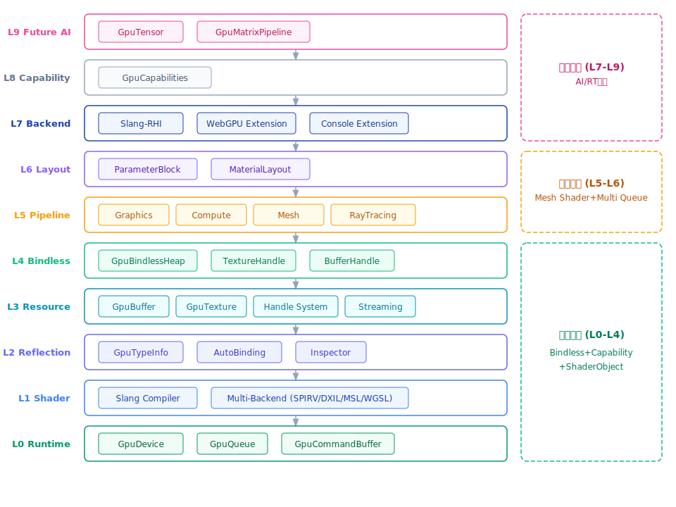
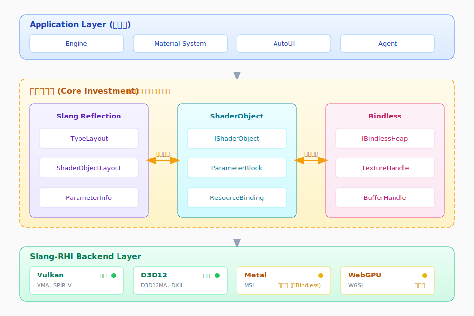

## 4. 系统架构设计

### 4.1 L0-L9 十层架构详解

系统采用 L0-L9 的十层垂直架构设计，确保了从底层硬件抽象到上层 AI 扩展的清晰边界与高度解耦。

| 层级 | 名称 | 核心职责 | 关键组件 |
| :--- | :--- | :--- | :--- |
| **L0** | **Runtime** | 统一包装底层对象，屏蔽第三方直接依赖 | `GpuDevice`, `GpuBuffer`, `GpuTexture` |
| **L1** | **Shader System** | 负责 .slang 源码的多后端编译与管理 | `ShaderCompiler`, `SlangModule` |
| **L2** | **Reflection** | 提取 Slang 反射信息并转化为引擎元数据 | `GpuTypeInfo`, `ReflectionCache` |
| **L3** | **Resource** | 实现 Handle 化管理与资源流送 | `GpuResourceHandle`, `StreamingManager` |
| **L4** | **Bindless** | 独立的基础设施，管理全局描述符堆 | `GpuBindlessHeap`, `DescriptorIndex` |
| **L5** | **Pipeline** | 统一管理各类渲染与计算管线状态 | `GraphicsPipeline`, `ComputePipeline` |
| **L6** | **Layout** | 实现从反射到材质参数块的直接映射 | `ParameterBlock`, `ResourceLayout` |
| **L7** | **Backend** | 适配 Slang-RHI 及原生 API 后端 | `VulkanBackend`, `MetalBackend` |
| **L8** | **Capability** | 独立的功能特性判断与硬件能力对齐 | `GpuCapabilities`, `FeatureGating` |
| **L9** | **Future AI** | 预留神经计算与矩阵加速接口 | `GpuTensor`, `GpuMatrixPipeline` |

### 4.2 架构图示

*图 1：L0-L9 十层系统分层架构图，展示了从 Runtime 到 Future AI 的完整垂直架构，右侧标注了三阶段分组（第一阶段 L0-L4、第二阶段 L5-L6、第三阶段 L7-L9）。*

### 4.3 核心模块设计

#### 4.3.1 Slang Reflection 集成方案

系统通过 `GpuTypeInfo` 模块深度集成 Slang 的反射系统。不同于传统的二进制布局反射，本方案采用"面向输入"的映射策略。通过解析 Slang 的 `TypeLayout`，自动生成对应于 TypeScript 绑定、编辑器 Inspector 以及 AI Agent 可识别的元数据结构 [6]。这消灭了手动维护 Binding Layout 的冗余工作，确保了 CPU 端数据结构与 GPU 端 Buffer 布局的绝对一致性 [3]。

#### 4.3.2 ShaderObject 扩展设计

基于 Slang-RHI 的 `IShaderObject` 机制，系统实现了参数块（Parameter Block）的自动绑定。每个 `ShaderObject` 作为一个逻辑容器，代表一个 Slang 类型实例。系统通过扩展该机制，支持嵌套参数块的自动偏移计算与描述符槽位分配，极大简化了复杂材质系统的胶水代码编写 [6]。

#### 4.3.3 Bindless 系统设计

`GpuBindlessHeap` 被设计为独立于 RenderGraph 的核心基础设施。系统采用全局唯一的描述符堆管理模式，所有纹理和缓冲区资源在创建后即获得一个全局唯一的 `Handle`（索引）。在 Shader 中，通过该索引直接访问资源，从而彻底摆脱传统 Descriptor Set 绑定的频率限制 [1][3]。

### 4.4 模块关系图示

*图 2：Slang 生态核心模块关系图，展示了 Reflection、ShaderObject、Bindless 三大核心投资方向之间的双向映射关系，以及它们与底层 Slang-RHI 后端的连接。*

### 4.5 后端适配策略

针对不同平台的特性与限制，系统采取了差异化的适配方案：

*   **Vulkan 后端**：作为首选成熟后端，利用 VMA 进行内存子分配，提供完整的 Bindless、Mesh Shader 及射线追踪支持 [8]。
*   **D3D12 后端**：集成 D3D12MA，重点支持 Work Graphs 扩展以实现 GPU 驱动的复杂任务调度 [8]。
*   **Metal 后端**：针对其缺失原生 Bindless 基础设施的问题，采用 Argument Buffers 进行模拟，并针对移动端 Tile-based 架构优化编码器状态管理 [6][34]。
*   **WebGPU 后端**：受限于 Web 标准，优先保证 Tensor 计算接口的兼容性，利用 WGSL 后端为 Web 端 AI 推理提供加速 [11]。

### 4.6 架构边界定义

为保持底层抽象层的纯粹性，明确界定以下开发边界：

*   **包含范围**：GPU Runtime 对象封装、Shader 自动化编译流水线、深度反射系统、Handle 化资源管理系统、多类型管线管理、后端驱动适配层 [3]。
*   **不包含范围**：RenderGraph（属于上层 Framework 层）、具体的材质业务逻辑、场景树管理、具体的渲染器实现（如 Forward/Deferred 路径） [3]。