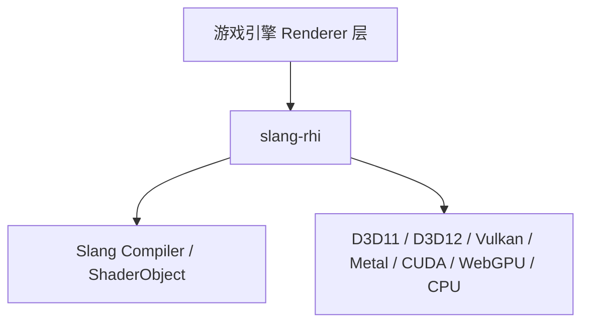

# slang-rhi 作为游戏引擎 Graphics RHI 层评估

## 结论（先说）

**可以作为引擎 RHI 的技术底座，但目前更适合「以 Slang 为核心、愿意承担 API 演进成本」的新引擎或渲染子系统，而不是拿来即用的通用生产级 RHI。**

README 已明确写明：项目仍在积极重构，**尚未 ready for general use**。能力面偏广、测试也较全，但成熟度、引擎向抽象、多队列调度等方面仍有明显缺口。

---

## 它是什么

`slang-rhi` 源自 Slang 仓库里的 **gfx 层**，定位是 **Slang 着色语言的跨 API RHI**，不是独立通用图形库。

核心抽象大致是：



---

## 优势：为什么「能当」引擎 RHI

### 1. 后端覆盖对 PC / 跨平台引擎友好

| 平台倾向 | 支持 |
|---------|------|
| Windows | D3D11、D3D12、Vulkan、CUDA、WebGPU |
| Linux | Vulkan、CUDA、WebGPU |
| macOS/iOS | Metal、Vulkan、WebGPU |

对「一套渲染代码、多 API」的引擎来说，覆盖面是够的。

### 2. 现代图形能力较完整

从 `Feature` 枚举和 API 可见，已覆盖引擎常见高级能力：

- 光栅：MSAA、ROV、Conservative Rasterization、Fragment Shading Rate、Mesh Shader
- 光追：BLAS/TLAS、Shader Table、Motion Blur、Cluster AS、SER
- 资源：Bindless、Parameter Block、Heap 子分配、共享句柄
- 计算：Cooperative Matrix/Vector（偏 AI/研究向，但引擎可用）

这比只做「画三角形」的薄封装要深一层。

### 3. 与 Slang 深度集成（双刃剑）

- `IShaderObject` / `createRootShaderObject`：参数块、嵌套 binding 由 Slang 反射驱动
- `IDevice::getSlangSession()`：设备与编译会话一体
- 多 target capability（SPIR-V、DXIL、Metal、WGSL 等）

若引擎 **shader 管线以 Slang 为中心**，这层 RHI 能少写大量 binding/layout 胶水代码。

### 4. 命令录制模型接近主流引擎

```
ICommandQueue → ICommandEncoder → IPassEncoder (Render/Compute/RT) → submit
```

另有：

- `ISurface`：swapchain acquire/present
- `IFence` + deferred delete：GPU 资源生命周期
- Debug layer：开发期校验
- `IPersistentCache`：shader/pipeline 持久化缓存
- `ITaskPool`：DAG 任务调度（适合并行编译、异步上传等）

### 5. 工程质量信号不错

- `docs/api.md` 有 **逐 API、逐后端** 实现矩阵
- `tests/` 约 90+ 测试，覆盖 draw、copy、RT、bindless、surface、fence 等
- 提供 `getNativeDeviceHandles()` 等逃生舱，便于与引擎自有系统或第三方库互操作

---

## 短板：为何还不能「直接当成品引擎 RHI」

### 1. 官方成熟度声明

```10:10:g:\work\tech\infra\slang-rhi\README.md
This library is under active refactoring and development, and is not yet ready for general use.
```

API 里还有大量 `GLOBAL TODO`、文档注释缺失——更像 **活跃演进的内部基础设施**，不是稳定公共 SDK。

### 2. 强绑定 Slang 生态

引擎若已有 HLSL/GLSL + 自研反射/材质系统，接入成本会很高。`slang-rhi` 的 binding 模型围绕 `IShaderObject` 设计，不是传统「slot + descriptor set 手写」风格。

**适合**：新引擎选 Slang 作为主 shader 语言。  
**不适合**：已有成熟 shader 管线的引擎做无痛替换。

### 3. 队列模型偏简化

```2775:2778:g:\work\tech\infra\slang-rhi\include\slang-rhi.h
enum class QueueType
{
    Graphics,
};
```

只有 **Graphics 队列**，没有独立的 Compute / Copy / Transfer 队列。对需要 **async compute、多队列并行、与 graphics 精细同步** 的 3A 级引擎，这是明显限制。

### 4. 后端实现不均衡

`docs/api.md` 显示不少缺口，例如：

| 能力 | 问题 |
|------|------|
| D3D11 | 无 Fence、无光追、部分 copy/clear 缺失 |
| CPU | 无光栅、无 Surface |
| Metal | 无 indirect draw、部分 query 不支持 |
| WGPU | 多项 clear、timestamp、RT 不支持 |
| CUDA Surface | 通过 Vulkan swapchain 间接实现 |

引擎若目标 **D3D12 + Vulkan + Metal 三主端**，需要接受 Metal/WGPU 上的功能降级或自行补洞。

### 5. 缺少引擎层常见「上层设施」

RHI 层通常不包这些，但意味着引擎还要自建：

- Frame Graph / Render Graph
- 自动 resource barrier（`setBufferState`/`globalBarrier` 仅在 D3D12/Vulkan 暴露，且无自动推导）
- 多帧 in-flight 资源环（ring buffer / per-frame allocator 需引擎实现）
- 纹理 streaming、mipmap 生成策略
- VR/XR、多 GPU、控制台 API
- 完整 HDR swapchain、可变刷新率等显示策略

`ISurface` 较基础（format、imageCount、vsync），够示例和工具，离商业引擎显示子系统还有距离。

### 6. 接口风格与生态

- COM 风格（`ISlangUnknown`、`ComPtr`）：与许多现代 C++ 引擎的 RAII/handle 风格不同
- 示例仅 triangle、shader-toy、surface 等，**缺少完整 mini-engine 参考架构**
- 社区采用面主要在 Slang 生态，第三方引擎集成案例少

---

## 与典型引擎 RHI 需求对照

| 引擎需求 | slang-rhi 现状 | 评价 |
|---------|----------------|------|
| 跨 API 抽象 | 7 后端 | 强 |
| Draw/Compute/RT | 有 | 强 |
| Swapchain/Present | `ISurface` | 基本可用 |
| Shader 编译与反射 | Slang 原生 | 强（限 Slang） |
| Bindless / 现代 binding | 有 | 强 |
| Async Compute 多队列 | 仅 Graphics Queue | 弱 |
| 资源屏障自动化 | 手动 + 部分后端 | 中 |
| 生产稳定性 | 自评未 general use | 弱 |
| 文档与 API 稳定 | 重构中 | 弱 |
| 引擎无关性 | 偏 Slang 专用 | 中偏弱 |

---

## 适用场景建议

### 较适合

1. **新建引擎，shader 栈选 Slang**（类似 Unity/Frostbite 走自研 DSL 的路线）
2. **研究型 / 工具型渲染**（光追、CUDA、cooperative matrix 等）
3. **在自有 Renderer 下包一层**：把 slang-rhi 当「Device + Command + Resource」实现，上层仍保留 Material、FrameGraph、Scene

### 需谨慎或不适合

1. 已有成熟 HLSL/GLSL 管线，短期要替换 RHI
2. 需要 **立即上生产**、API 长期稳定
3. 重度依赖 **async compute 多队列**、VR、主机平台
4. 希望 RHI **与 shader 语言解耦**（类似 bgfx、Diligent 的定位）

---

## 若决定采用，建议架构

```text
┌─────────────────────────────────────┐
│  Game Engine (Scene, Material, FG)  │
├─────────────────────────────────────┤
│  Engine RHI Wrapper (你们的接口)     │  ← 隔离 API 变动
├─────────────────────────────────────┤
│  slang-rhi (IDevice/ICommandQueue)  │
├─────────────────────────────────────┤
│  Slang (编译、反射、ShaderObject)    │
└─────────────────────────────────────┘
```

关键实践：

1. **不要直接让 gameplay 依赖 `slang-rhi.h`**，自建薄封装
2. 主目标后端定为 **D3D12 + Vulkan + Metal**，D3D11/WGPU 作降级
3. 自行实现 **帧资源管理、barrier 策略、多帧同步**
4. 跟踪上游 breaking change，CI 跑 `-check-devices` 全后端测试
5. 评估是否 fork/vendor，避免被 Slang 内部重构牵着走

---

## 总评

| 维度 | 评分（5 分制） | 说明 |
|------|---------------|------|
| 技术能力广度 | 4.5 | 现代特性全，后端多 |
| 与 Slang 协同 | 5 | 核心设计目标 |
| 生产就绪度 | 2 | 官方未宣称 general use |
| 引擎通用性 | 2.5 | 强依赖 Slang，缺多队列等 |
| 可扩展/逃生舱 | 4 | native handle、debug layer |
| 长期维护 | 4 | Shader-Slang 官方项目，活跃开发 |

**一句话**：`slang-rhi` 具备成为 **Slang 系游戏引擎 Graphics RHI** 的骨架和大部分能力，但更像「Slang 官方渲染运行时」，而非「即插即用的通用引擎 RHI」。若你们引擎已或计划以 Slang 为核心，值得作为底层；若是传统引擎换 RHI，更现实的路径是参考其设计，或选更成熟的跨 API 方案，再按需集成 Slang 编译器。

---

如果你愿意，我可以基于你们引擎现状（是否用 Slang、目标平台、是否要光追/async compute）给一份更具体的 **接入方案 vs 自研 RHI** 对比表。